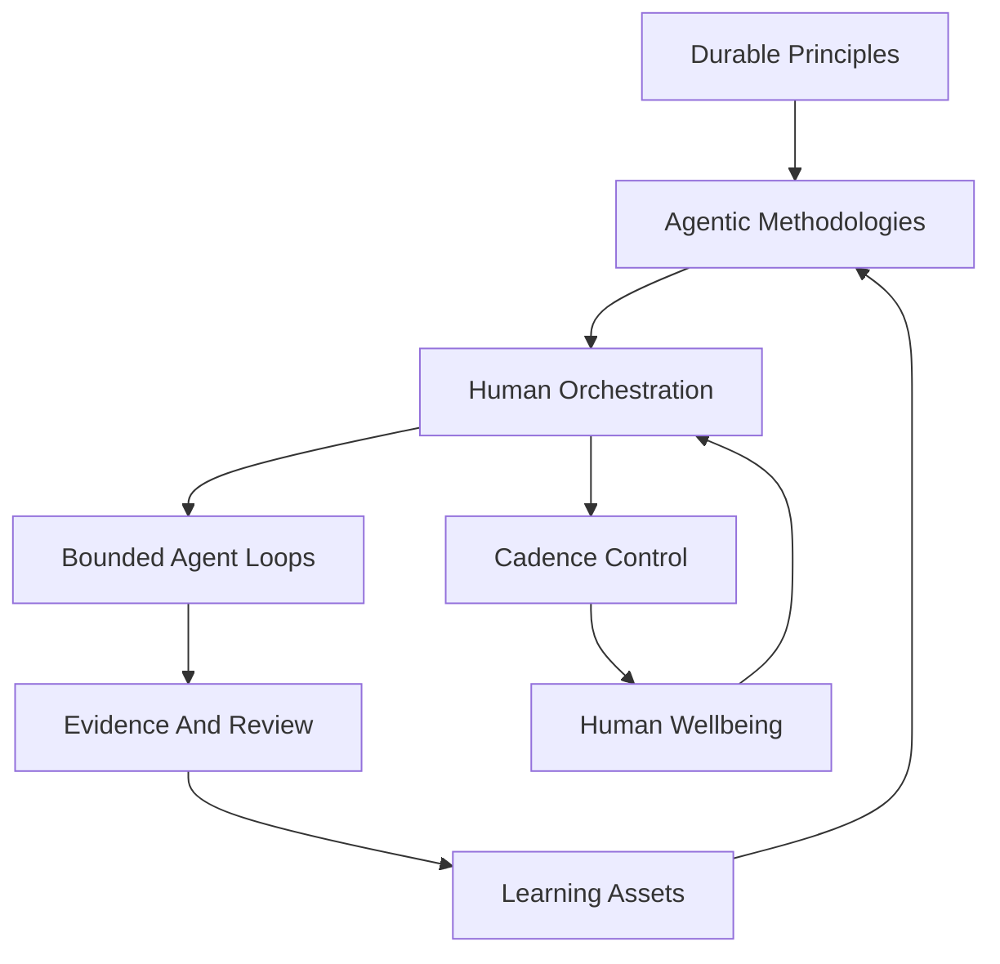

# Future Of Agentic Engineering

This is the main summary for a six-document research set on the future of agentic engineering. The local `agentic_engineering` package was used as a current operating-model seed, not as a fixed target. Later package changes should be informed by these findings.

## Specialized Documents

1. [Part 1 - Principles And Methodologies](future_of_agentic_engineering_part_1_principles_methodologies.md)
2. [Part 2 - Human Skill Changes](future_of_agentic_engineering_part_2_human_skill_changes.md)
3. [Part 3 - Cadence And Mental Discipline](future_of_agentic_engineering_part_3_cadence_mental_discipline.md)
4. [Part 4 - Compounding And Equilibrium](future_of_agentic_engineering_part_4_compounding_equilibrium.md)
5. [Part 5 - Wellbeing, Sustainability, And Education](future_of_agentic_engineering_part_5_wellbeing_sustainability_education.md)

## Executive Thesis

Agentic engineering is not simply "AI writes code." It is software development in which humans design, steer, verify, and improve systems of goal-directed agents that can gather context, use tools, modify artifacts, run checks, and produce evidence inside bounded workflows.

The durable principles of software and product development still hold: customer value, small batches, technical excellence, working software, independent verification, risk management, observability, sustainable pace, and learning. The methodologies change: agents, skills, MCP tools, subagents, worktrees, memory, compaction, evals, and repeatable loops make parts of the SDLC executable.

The central human shift is from narrow task execution toward accountable orchestration. Humans become more effective when they can move across product, requirements, design, architecture, engineering, quality, security, release, operations, and learning well enough to frame goals, set boundaries, review evidence, and integrate outputs.

## The Argument In Sequence

### 1. Principles Stay, Methods Change

Part 1 separates principles from methods. The principles that drove good software for decades still matter. Agentic systems do not remove the need for requirements, tests, review, release discipline, or learning. They compress parts of the lifecycle into executable loops.

Writing loops are a subset of the SDLC when they include context gathering, planning, change, verification, and decision gates. A loop without verification is only automation. A loop with evidence becomes an executable slice of software delivery.

### 2. The Human Skill Profile Broadens

Part 2 argues that agentic leverage rewards orchestrator-generalists. This does not mean everyone becomes a shallow generalist. It means the human in the loop needs enough breadth to recognize good and bad work across the lifecycle.

The strongest human profile becomes comb-shaped:

- Deep skill in one or two domains.
- Working fluency across the lifecycle.
- Strong judgment about evidence, risk, and user value.
- Ability to encode repeated lessons into tests, tools, skills, templates, and instructions.

Determinism is reframed as bounded repeatability. LLMs are not perfectly deterministic, but workflows can be made reliable through explicit context, scoped tools, structured outputs, reproducible checks, decision logs, and review gates.

### 3. Humans Should Control Tempo, Not Match Agent Speed

Part 3 studies cadence asymmetry. Agents can run longer, faster, and in parallel. Humans cannot and should not try to match that cadence through longer hours.

The right adaptation is tempo control:

- Review windows instead of constant interruption.
- Work packets instead of endless chat threads.
- WIP limits based on human review capacity.
- Checkpoints before risky changes.
- Stop rules for drifting or looping agents.
- Recovery discipline as part of the delivery system.

Historical analogies from automation, aviation, lean production, SRE, and automated trading all point in the same direction: speed needs observability, mode awareness, stop rules, and governors.

### 4. Compounding Is Real But Bounded

Part 4 explains the compounding mechanism. Agentic engineering compounds when successful work improves future work: code becomes tests, tests become confidence, repeated prompts become skills, decisions become architecture records, and incidents become runbooks.

But compounding stabilizes through natural limits:

- Human attention bandwidth.
- Verification cost.
- Maintenance burden.
- Context complexity.
- Token, compute, and tool cost.
- Risk and governance.
- Valuable problem supply.
- Organizational absorption.

The equilibrium is not infinite acceleration. Prototypes become cheaper, production remains hard, expert review becomes scarcer, smaller accountable teams gain leverage, and governance becomes productive when embedded in tools.

### 5. Wellbeing And Education Become Strategic

Part 5 argues that wellbeing is part of the agentic control system. If humans remain responsible for judgment, their clarity, sleep, attention, ethics, learning, and social grounding matter operationally.

The future should be approached with disciplined agency:

- Avoid panic.
- Avoid complacency.
- Learn the tools.
- Preserve human fundamentals.
- Convert lessons into durable systems.
- Keep responsibility close to affected people.

Education should not reduce to "teach children to prompt." Children need foundational literacy, computational thinking, AI literacy, making, productive difficulty, ethics, and human collaboration. Prompting will change; the durable skill is the ability to think, build, verify, care, and adapt.

## System Model

## Proposed Direction For The Package

The current package is a useful classical operating model because it names roles, trackers, gates, and learning artifacts. The future package should likely evolve from a static role-and-document scaffold into an agentic operating system.

Recommended package evolution:

- Convert role files into role lenses, review gates, and reusable skills.
- Add a loop library for common workflows: discovery, requirements, design review, implementation, test hardening, security review, release readiness, incident learning.
- Add work-packet templates for agent outputs: goal, context, files changed, tests run, evidence, risks, open questions, next action.
- Add safe tool-use guidance: permissions, confirmation gates, sandbox rules, external-action rules, and audit logging.
- Add WIP and cadence controls: active run limits, review windows, checkpoint rules, safe overnight classifications.
- Add compounding mechanisms: skill registry, eval registry, decision-to-instruction path, test promotion, runbook promotion.
- Add metrics for accepted output, rework, review burden, defect escape, cost, human interruption, and recovery risk.
- Add education and training paths for orchestrator-generalists.

## Practical North Star

The best future version of `agentic_engineering` should help a human do four things:

1. Choose the right work.
2. Delegate bounded loops safely.
3. Verify outcomes with evidence.
4. Convert learning into a stronger system.

If it only helps agents produce more artifacts, it will miss the point. If it helps humans preserve principles while upgrading methodologies, it can become a real operating system for responsible agentic software development.

## Research Notes

The research combined local package inspection with current public sources on AI agents, Codex skills, MCP, DORA, Agile, SRE, NIST AI risk management, AI labor/productivity research, automation human factors, WEF skills research, and UNESCO/OECD education guidance.

The `last30days` plugin was considered optional. It was not used for the main evidence base because this environment showed first-run setup was not complete, and the plugin's setup flow would require explicit consent for browser-cookie and source configuration. The documents therefore rely on local package analysis plus web research and primary/credible sources.

## Shared Source Base

- [Principles behind the Agile Manifesto](https://agilemanifesto.org/principles.html)
- [DORA Research: 2024 Accelerate State of DevOps Report](https://dora.dev/research/2024/dora-report/)
- [DORA Research: 2025 State of AI-assisted Software Development](https://dora.dev/research/2025/dora-report/)
- [OpenAI Agents SDK: Agents](https://openai.github.io/openai-agents-python/agents/)
- [OpenAI Codex: Prompting](https://developers.openai.com/codex/prompting)
- [OpenAI Codex: Agent Skills](https://developers.openai.com/codex/skills)
- [OpenAI Codex: Subagents](https://developers.openai.com/codex/subagents)
- [Model Context Protocol: Tools](https://modelcontextprotocol.io/specification/2025-06-18/server/tools)
- [Model Context Protocol: Resources](https://modelcontextprotocol.io/specification/2025-06-18/server/resources)
- [NIST AI Risk Management Framework](https://www.nist.gov/itl/ai-risk-management-framework)
- [Google SRE Book: Eliminating Toil](https://sre.google/sre-book/eliminating-toil/)
- [Lisanne Bainbridge, Ironies of Automation](https://web.archive.org/web/20200717054958if_/https://www.ise.ncsu.edu/wp-content/uploads/2017/02/Bainbridge_1983_Automatica.pdf)
- [Human-In-The-Loop Software Development Agents: Challenges and Future Directions](https://arxiv.org/abs/2506.11009)
- [Measuring AI Ability to Complete Long Tasks](https://arxiv.org/abs/2503.14499)
- [Measuring the Impact of Early-2025 AI on Experienced Open-Source Developer Productivity](https://arxiv.org/abs/2507.09089)
- [World Economic Forum: Future of Jobs Report 2025](https://www.weforum.org/publications/the-future-of-jobs-report-2025/)
- [UNESCO AI competency frameworks for teachers and students](https://www.unesco.org/en/digital-education/ai-future-learning/competency-frameworks)
- [OECD Future of Education and Skills 2030](https://www.oecd.org/en/about/projects/future-of-education-and-skills-2030.html)
