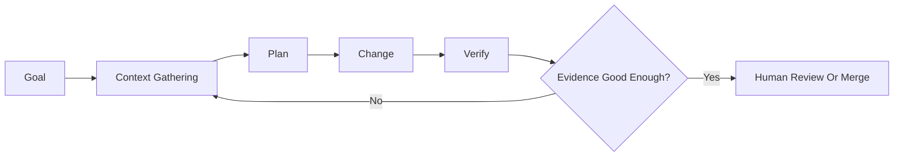

# Future Of Agentic Engineering, Part 1: Principles And Methodologies

Main summary: [future_of_agentic_engineering.md](future_of_agentic_engineering.md)
Next: [Part 2 - Human Skill Changes](future_of_agentic_engineering_part_2_human_skill_changes.md)

## Purpose

This document separates durable software-development principles from the newer methods used in agentic software work. The local `agentic_engineering` package is useful as a current operating-model seed because it names a full lifecycle, roles, review gates, trackers, and learning loops. It is not treated as the answer. The package should later be modified by the research, not protected from it.

## Core Thesis

Agentic software development does not repeal the old principles of good software work. It changes the unit of execution.

The old unit was usually a person, team, sprint, ticket, or pull request. The emerging unit is a loop: an agent or agent group receives a goal, gathers context, plans, edits, tests, explains, and asks for approval or continues. This loop can compress pieces of the classical SDLC into minutes, but it still needs the same controls that made software delivery work before: customer value, small batches, explicit requirements, technical excellence, independent verification, risk management, observability, and sustainable pace.

The practical difference is that methodology becomes more executable. Instructions, skills, MCP servers, tool permissions, worktrees, subagents, tests, evals, and review prompts are not merely documentation. They shape what the system can do.

## What The Local Package Already Encodes

The package currently expresses a classical responsible-minimum software organization:

- Intake and product direction.
- External knowledge review.
- Requirements and acceptance criteria.
- UX and architecture.
- Sprint planning.
- Backend, frontend, and integration implementation.
- Code quality, QA, and security review.
- Release, deployment, monitoring, support, and retrospectives.

That structure is valuable because it captures the breadth of thinking required to ship real software. Its risk is that it may look like a fixed 12-role human organization. In an agentic system, these roles should become lenses and gates, not necessarily people. A future package should preserve the role perspectives while allowing one human to instantiate many perspectives through agents, skills, checklists, and validation loops.

## Principles That Remain Stable

### 1. Customer Value Beats Activity

The Agile Manifesto principles put customer satisfaction through early and continuous delivery of valuable software first, and they make working software the primary measure of progress. Agentic systems make activity cheap: branches, diffs, documents, tests, tickets, and dashboards can multiply quickly. That makes the principle more important, not less. The question is not "how many agents ran?" but "what user, operational, or learning value changed?"

Implication for agentic engineering: every loop needs an outcome statement and acceptance evidence. If an agent cannot verify the value, it has only produced motion.

### 2. Small Batches Still Win

Agile favors frequent working software on shorter timescales. DORA's research keeps returning to the importance of delivery fundamentals such as small batches, testing, and stable priorities. Agentic systems tempt humans to delegate huge, vague goals because agents can keep working while the human sleeps. That increases context drift, review burden, and hidden rework.

Implication: agentic tasks should be sliced by verifiability, not by how much an agent can attempt. The ideal task is large enough to produce useful value and small enough that its diff, tests, and rationale can be reviewed by a tired human.

### 3. Technical Excellence Is A Speed Strategy

Agile explicitly links technical excellence and good design to agility. This becomes sharper with agents. If the repo has clear architecture, tests, scripts, conventions, and documented setup, agents can operate with higher confidence. If the repo is ambiguous, agents spend tokens rediscovering intent or generate plausible but wrong code.

Implication: internal developer platforms, good test harnesses, stable local setup, typed interfaces, code owners, and architecture records are no longer overhead. They are agent affordances.

### 4. Human Judgment Moves Upstream And Downstream

Humans do less literal typing, but more task framing, boundary setting, evidence evaluation, and final accountability. The Model Context Protocol documentation explicitly frames tools as model-controlled while recommending user visibility and human confirmation for operations. The same principle should govern coding agents: autonomy is useful only when there is a clear boundary for what the agent may do and what requires human judgment.

Implication: humans should approve goals, permissions, sensitive operations, irreversible changes, and release decisions. Agents can perform much of the search, edit, test, and explanation work inside those boundaries.

### 5. Risk Management Must Be Layered

NIST's AI Risk Management Framework is designed to incorporate trustworthiness into design, development, use, and evaluation of AI systems. Software teams already know defense in depth from security, QA, release management, and SRE. Agentic systems need the same layered control model because any single defense can fail: prompt instructions can be ignored, tests can be incomplete, review can be tired, and tool permissions can be too broad.

Implication: a safe agentic workflow combines sandboxing, least-privilege tools, scoped tasks, tests, static analysis, human review, audit logs, rollback plans, and production monitoring.

### 6. Sustainability Is A Delivery Constraint

Agile names sustainable development and a pace that can be maintained indefinitely. Google SRE's work on toil gives a useful boundary: repetitive, manual, automatable, interrupt-driven work that scales linearly is toxic when it dominates. Agentic systems can remove toil, but they can also create new toil: supervising too many runs, reviewing large diffs, managing failed branches, debugging hallucinated assumptions, and absorbing constant notifications.

Implication: agentic engineering should measure human review load, interruption rate, rework, and cognitive fatigue, not only agent throughput.

## New Methodologies

### Agents

An agent is not just a chat model. In the OpenAI Agents SDK, an agent is an LLM configured with instructions, tools, optional handoffs, guardrails, structured outputs, lifecycle hooks, and sessions. That definition matters. The engineering object is the whole runtime: model, prompt, context, tools, policy, memory, and observability.

Methodological use:

- Use single agents for focused tasks with clear verification.
- Use manager-style orchestration when one controller should retain context and call specialist agents as tools.
- Use handoffs when a specialist should take over the conversation or task state.
- Use lifecycle hooks, traces, and structured outputs when the workflow must be inspected or evaluated.

### Skills

Skills package reusable workflow knowledge. Codex skills are directories with a `SKILL.md` file plus optional scripts, references, assets, and agent configuration. They use progressive disclosure: only the name, description, and path are initially loaded, and the full instructions are read when selected.

Methodological use:

- Turn repeated human craft into explicit reusable instructions.
- Put narrow, high-signal workflows into skills rather than long global prompts.
- Store scripts and templates with the skill when reliable execution requires more than prose.
- Treat third-party skills as supply-chain inputs because a skill can carry procedural authority.

### MCP And Connectors

MCP standardizes how models discover and invoke tools or read resources. MCP tools expose callable actions with schemas; resources expose context such as files, database schemas, or application information. The security guidance is crucial: tools should be visible, sensitive operations should be confirmable, inputs and outputs should be validated, and tool use should be logged.

Methodological use:

- Convert organizational systems into bounded tool surfaces.
- Prefer typed, narrow tools over broad shell access where possible.
- Separate resources from actions: reading context is not the same as mutating state.
- Treat tool descriptions and annotations as untrusted unless they come from trusted servers.

### Loops

The most important methodological shift is the loop. Codex documentation describes Codex as calling the model, performing actions such as file reads, edits, and tool calls, and repeating until the task is complete or cancelled. This is a miniature SDLC:

This confirms the user's hypothesis with one correction: writing loops are a subset of the SDLC only when they include verification and decision gates. A prompt that says "keep working until done" is not SDLC. A loop that asks for context, plans, implements, tests, records assumptions, and stops at a review gate is an executable slice of the SDLC.

### Subagents And Parallelism

Subagents allow work to be split into parallel perspectives: explorer, worker, security reviewer, test reviewer, documentation reviewer, performance reviewer. Codex documentation notes that subagent workflows are useful for highly parallel complex tasks and consume more tokens than comparable single-agent runs.

Methodological use:

- Use subagents for independent perspectives, not merely more output.
- Prefer parallel exploration, review, and test generation over parallel edits to the same files.
- Use worktrees or branch isolation when multiple agents may edit code.
- Consolidate results through one accountable human or manager agent.

### Verification And Evals

The emerging methodology is not "prompt better"; it is "make the work verifiable." Good prompts include reproduction steps, validation commands, linting, and pre-commit checks. Research on human-in-the-loop software agents highlights that unit testing cost and variability in LLM-based evaluation are major challenges. This pushes teams toward layered evidence:

- Automated tests for behavior.
- Static analysis and type checks for structure.
- Lint and formatting for consistency.
- Security scanning for known risk classes.
- Human review for intent, tradeoffs, and unstated constraints.
- Production telemetry for real-world feedback.

### Memory And Compaction

Agentic work can span long-running threads, multiple files, and repeated sessions. Memory and compaction are not convenience features. They are methodology because they decide what the agent remembers, forgets, compresses, or overweights.

Methodological use:

- Keep durable project knowledge in versioned files, not only chat history.
- Compact around decisions, assumptions, tests run, unresolved risks, and next actions.
- Avoid letting stale memory override current source code, current docs, or current product intent.

## Classical SDLC Reinterpreted

| Classical concern | Agentic method | Human responsibility |
|---|---|---|
| Idea intake | Goal prompt, issue, product brief | Decide whether the goal matters |
| Requirements | Agent-assisted story and acceptance criteria drafting | Ensure testability and business meaning |
| Design | UX, architecture, threat-model agents | Choose tradeoffs and reject incoherent designs |
| Implementation | Worker agents, tools, codebase context | Scope, permissions, and review |
| Testing | Agent-generated tests, CI, evals | Judge coverage and risk |
| Review | Subagent review, code review, security review | Resolve conflicts and own approval |
| Release | Deployment scripts, checklists, runbooks | Decide go/no-go and rollback readiness |
| Operations | Monitoring, incident agents, support summarization | Maintain situational awareness |
| Learning | Retrospective summaries, skills, updated rules | Convert lessons into system changes |

## What This Means For The Package Later

The package should likely evolve from a static role-based folder system into an agentic operating system with:

- Role lenses expressed as reusable skills and review prompts.
- Trackers that can be read and updated by agents through safe tools.
- A loop library for common workflows: discovery, requirements, design review, implementation, test hardening, release readiness, incident learning.
- Explicit gates for permissions, irreversible actions, security-sensitive changes, and release.
- Metrics for value, stability, review burden, rework, cost, and human wellbeing.
- A learning mechanism that promotes repeated successful workflows into skills.

## Working Definition

Agentic engineering is software development in which humans design, steer, verify, and improve systems of goal-directed AI agents that can gather context, use tools, modify artifacts, run checks, and produce evidence inside bounded workflows.

It is not "AI writes code." It is the executable management of the whole product-development loop.

## Sources

- [Principles behind the Agile Manifesto](https://agilemanifesto.org/principles.html)
- [DORA Research: 2024 Accelerate State of DevOps Report](https://dora.dev/research/2024/dora-report/)
- [DORA Research: 2025 State of AI-assisted Software Development](https://dora.dev/research/2025/dora-report/)
- [DORA: Choosing measurement frameworks to fit your organizational goals](https://dora.dev/research/2025/measurement-frameworks/)
- [OpenAI Agents SDK: Agents](https://openai.github.io/openai-agents-python/agents/)
- [OpenAI Codex: Prompting](https://developers.openai.com/codex/prompting)
- [OpenAI Codex: Agent Skills](https://developers.openai.com/codex/skills)
- [OpenAI Codex: Subagents](https://developers.openai.com/codex/subagents)
- [Model Context Protocol: Tools](https://modelcontextprotocol.io/specification/2025-06-18/server/tools)
- [Model Context Protocol: Resources](https://modelcontextprotocol.io/specification/2025-06-18/server/resources)
- [NIST AI Risk Management Framework](https://www.nist.gov/itl/ai-risk-management-framework)
- [Google SRE Book: Eliminating Toil](https://sre.google/sre-book/eliminating-toil/)
- [Human-In-The-Loop Software Development Agents: Challenges and Future Directions](https://arxiv.org/abs/2506.11009)

## How This Informs Part 2

If the stable principles remain broad but the methods become executable loops, the human role cannot remain narrow. The human in the loop must understand enough product, requirements, design, architecture, quality, security, release, and economics to steer the whole system without becoming the bottleneck or accepting unsafe work.
