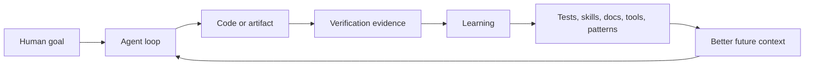

# Future Of Agentic Engineering, Part 4: Compounding And Equilibrium

Main summary: [future_of_agentic_engineering.md](future_of_agentic_engineering.md)
Previous: [Part 3 - Cadence And Mental Discipline](future_of_agentic_engineering_part_3_cadence_mental_discipline.md)
Next: [Part 5 - Wellbeing Sustainability And Education](future_of_agentic_engineering_part_5_wellbeing_sustainability_education.md)

## Purpose

Part 3 argued that humans need cadence control because agents can run faster and longer than human attention. This document examines the compounding effect: as humans use agentic systems, their ability to build new things can increase because every good loop can create reusable assets. But no compounding process runs forever. This document identifies the stabilizing factors, winners, losers, and likely equilibrium.

## Core Thesis

Agentic engineering compounds when work improves the future work environment.

One agent run can produce a fix. A better run produces a fix plus a test. A still better run produces a fix, test, documentation, decision record, and reusable skill. Over time, the team accumulates code, tests, prompts, skills, tools, runbooks, architecture records, and evaluation suites that make future work easier.

But compounding is limited by review capacity, verification cost, context complexity, maintenance burden, budgets, risk tolerance, and the availability of valuable problems. The equilibrium will not be infinite acceleration. It will be a new separation between teams that convert agent output into durable systems and teams that merely generate more artifacts.

## The Compounding Loop

Agentic systems compound through asset conversion:

The critical step is not generation. It is conversion. If a successful run does not become a test, skill, standard, reusable script, or documented decision, the learning stays local and decays.

## Sources Of Compounding Advantage

### 1. Better Context

Agents perform better when the repo has clear structure, conventions, tests, and documentation. Every architecture decision, setup note, test fixture, and runbook improves the agent's future context.

Advantage goes to teams that maintain readable systems.

### 2. Better Verification

The stronger the test and evaluation environment, the more work can be safely delegated. Teams with fast CI, good fixtures, stable local setup, and meaningful integration tests can let agents attempt more because failures are visible.

Advantage goes to teams that invested in quality before AI, and to teams that now use AI to build missing quality infrastructure.

### 3. Better Skills And Reusable Loops

Repeated work can be packaged into skills: release-building, dependency updates, security review, incident triage, API migration, UI polish, documentation refresh, data-backfill planning. Skills reduce prompt variance and encode local standards.

Advantage goes to teams that turn lessons into reusable workflows.

### 4. Better Tooling And Permissions

MCP servers, internal CLIs, dashboards, and structured tools let agents act on real systems without broad unsafe access. Narrow, typed tools are more repeatable than free-form shell access for many organizational tasks.

Advantage goes to teams with strong internal platforms.

### 5. Better Human Taste

Agents can produce many options. Humans with product taste, engineering taste, and risk judgment can select the right option faster. Taste compounds because good selections become standards and examples.

Advantage goes to humans who can judge quality across domains.

## Natural Stabilizing Factors

### 1. Human Attention Bandwidth

Attention is the first limit. More agent output creates more review work unless the system filters, summarizes, and verifies well. A single human can start many runs, but cannot deeply review all outputs at the same time.

Equilibrium effect: agent parallelism will be capped by review bandwidth and trust in automated checks.

### 2. Verification Cost

Some work has cheap ground truth: formatting, unit tests, type checks, dependency updates. Other work has expensive ground truth: product-market fit, UX quality, security posture, strategy, legal interpretation, and complex migrations.

Equilibrium effect: agent autonomy will be highest where feedback is fast and objective, and lower where judgment or real-world validation is required.

### 3. Maintenance Burden

More code is not automatically more progress. Research on AI coding tools shows that productivity gains can be context-dependent, and some studies find experienced developers slowed down or carrying more review and rework burden. This is not proof that AI coding is useless. It is evidence that generated work can move the bottleneck to maintenance.

Equilibrium effect: mature systems with high quality standards will require stronger filters than greenfield prototypes.

### 4. Context And System Complexity

As a codebase grows, the relevant context for any change becomes harder to identify. Agents may miss hidden coupling, implicit product rules, data migration hazards, or production history.

Equilibrium effect: architecture clarity and context curation become strategic assets.

### 5. Token, Compute, And Tool Cost

Every run consumes model inference, tool calls, storage, CI minutes, review time, and sometimes cloud resources. Costs may fall over time, but demand expands when capability expands.

Equilibrium effect: organizations will manage agent work as a portfolio: cheap quick checks for routine work, deeper expensive loops for high-value work, and no run when the decision is not worth the cost.

### 6. Risk And Governance

As agents gain tool access, they can affect code, data, infrastructure, customers, vendors, and compliance obligations. NIST's risk-management framing implies that governance must be integrated into design, development, deployment, and monitoring.

Equilibrium effect: high-risk domains will adopt agents through controlled pathways, not unlimited autonomy.

### 7. Valuable Problem Supply

Once easy automation and obvious product ideas are exhausted, the bottleneck returns to understanding users, markets, constraints, and strategy. Agents can generate implementations faster than humans can discover what should exist.

Equilibrium effect: product discovery and domain knowledge remain scarce.

### 8. Organizational Absorption

An organization must absorb change: customers need onboarding, support needs docs, sales needs positioning, security needs review, finance needs cost visibility, operations need runbooks. Agentic output that the organization cannot absorb becomes churn.

Equilibrium effect: organizational learning rate becomes a ceiling on technical generation rate.

## Who Gains Advantage

### Individuals

High advantage:

- People with strong product judgment and enough technical fluency to inspect work.
- Engineers who can design tests, tools, and architecture that agents can use.
- Specialists who encode expertise into reusable skills, checklists, evals, and review gates.
- People with strong writing, synthesis, and decision-making habits.
- People who can manage attention and cadence.

Lower advantage:

- People who only outsource judgment to the model.
- People who measure output volume rather than validated outcomes.
- Narrow specialists who cannot explain their standards or integrate with the broader lifecycle.
- Developers who accept large generated diffs without understanding them.

### Teams

High advantage:

- Small teams with clear ownership, fast review, and strong tests.
- Product teams close to users and able to validate quickly.
- Engineering teams with internal platforms, CI, observability, and clean architecture.
- Security-conscious teams that give agents safe tools rather than banning or ignoring them.
- Teams that record decisions and promote repeated workflows into skills.

Lower advantage:

- Teams with ambiguous priorities.
- Teams with weak tests and slow review.
- Teams with large legacy systems and undocumented coupling.
- Teams that treat AI as a headcount replacement without redesigning process.
- Teams that allow shadow AI without governance.

### Organizations

High advantage:

- Organizations with proprietary context, distribution, customer trust, and domain data.
- Organizations that can deploy agentic workflows inside their operating system.
- Organizations with cultures of measurement and retrospection.
- Organizations that can train workers across the lifecycle.

Lower advantage:

- Organizations with fragmented tools and locked-away knowledge.
- Organizations that reward visible activity over outcomes.
- Organizations with approval bottlenecks that prevent iteration.
- Organizations that underinvest in quality and then drown in generated work.

## Who Loses

The clearest losers are not "coders" as a class. The losers are roles and organizations that depend on scarcity of execution rather than quality of judgment.

At risk:

- Boilerplate implementation as a standalone value proposition.
- Shallow project management that only moves tickets.
- Manual QA that never becomes test strategy or risk analysis.
- Documentation that only restates the UI and never captures product understanding.
- Review processes that check formatting but not behavior, risk, or maintainability.
- Outsourcing models based on labor hours rather than ownership of outcomes.

But many of these roles can transform. The same QA role can become more valuable as evaluation architect. The same project manager can become agentic workflow designer. The same documentation owner can become customer-feedback intelligence lead.

## The New Equilibrium

### 1. Prototypes Become Cheap

The cost of first drafts, demos, and internal tools falls sharply. This makes "I can build a prototype" less differentiating.

Durable advantage moves to knowing which prototype matters, validating it, hardening it, distributing it, operating it, and improving it.

### 2. Production Remains Hard

Production software still requires reliability, security, migration safety, observability, support, documentation, and user trust. Agents can help with all of this, but they do not remove the need for accountability.

The equilibrium separates demo-speed from production-speed.

### 3. Human Review Becomes A Scarce Resource

As agent output rises, expert review becomes more valuable. Senior engineers, product leaders, security reviewers, and domain experts may become bottlenecks unless their judgment is encoded into systems.

The equilibrium rewards organizations that scale expert judgment through tests, tools, skills, and standards.

### 4. Work Moves Toward Smaller Accountable Teams

When execution is cheaper, large handoff-heavy structures lose some advantage. Smaller teams with strong ownership can use agents to cover more lifecycle surface area.

The equilibrium is not one person replacing a whole company. It is smaller accountable units supported by agentic infrastructure.

### 5. Governance Becomes Productive, Not Merely Defensive

Good governance will not be a blocker. It will be what enables safe autonomy. Permissions, evals, audit logs, and release gates allow more work to happen with less fear.

The equilibrium rewards governance that is embedded in tools rather than imposed after the fact.

## Implications For The Future Package

The package should later include explicit compounding mechanisms:

- A skill registry for promoted workflows.
- A test and eval registry tied to requirements and risks.
- A decision-to-instruction path: when a decision repeats, convert it into guidance or automation.
- Metrics for generated output, accepted output, rework, review burden, and production incidents.
- Cost tracking for tokens, CI, cloud resources, and human review time.
- A governance model that distinguishes prototype, internal tool, user-facing feature, infrastructure change, data change, and production release.

The package should make learning durable. Otherwise, agents will create temporary acceleration but not compounding advantage.

## Sources

- [Measuring AI Ability to Complete Long Tasks](https://arxiv.org/abs/2503.14499)
- [Measuring the Impact of Early-2025 AI on Experienced Open-Source Developer Productivity](https://arxiv.org/abs/2507.09089)
- [AI-assisted Programming May Decrease the Productivity of Experienced Developers by Increasing Maintenance Burden](https://arxiv.org/abs/2510.10165)
- [AI and jobs: A review of theory, estimates, and evidence](https://arxiv.org/abs/2509.15265)
- [DORA Research: 2025 State of AI-assisted Software Development](https://dora.dev/research/2025/dora-report/)
- [DORA: Choosing measurement frameworks to fit your organizational goals](https://dora.dev/research/2025/measurement-frameworks/)
- [NIST AI Risk Management Framework](https://www.nist.gov/itl/ai-risk-management-framework)
- [OpenAI Codex: Agent Skills](https://developers.openai.com/codex/skills)
- [Model Context Protocol: Tools](https://modelcontextprotocol.io/specification/2025-06-18/server/tools)
- [World Economic Forum: Future of Jobs Report 2025](https://www.weforum.org/publications/the-future-of-jobs-report-2025/)

## How This Informs Part 5

If compounding is real but bounded, wellbeing and education become strategic. Humans need to learn how to use agentic systems without being consumed by them, and children need foundations that remain valuable when tools change.
